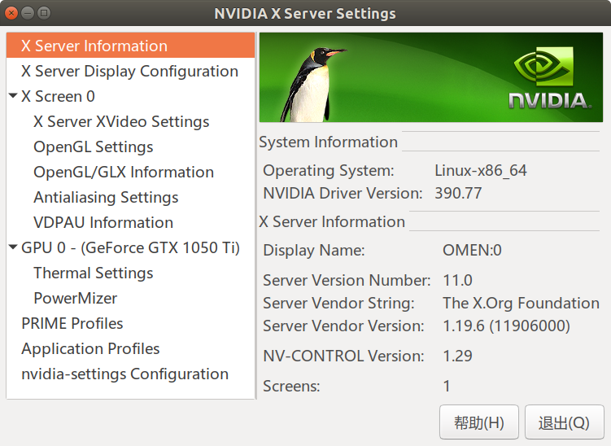
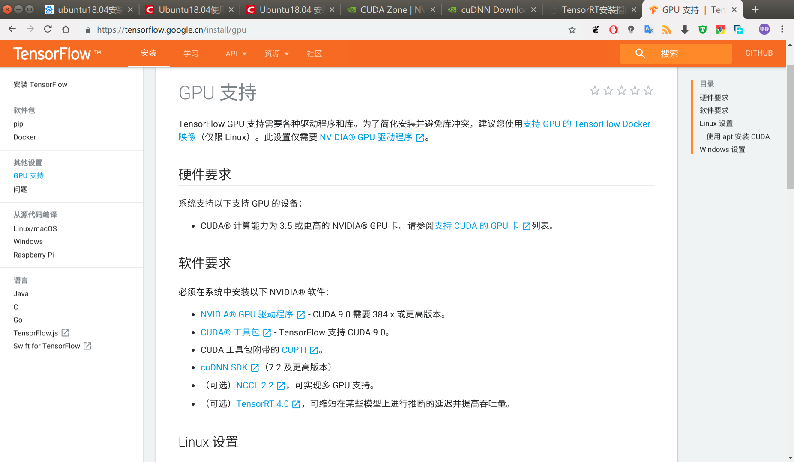
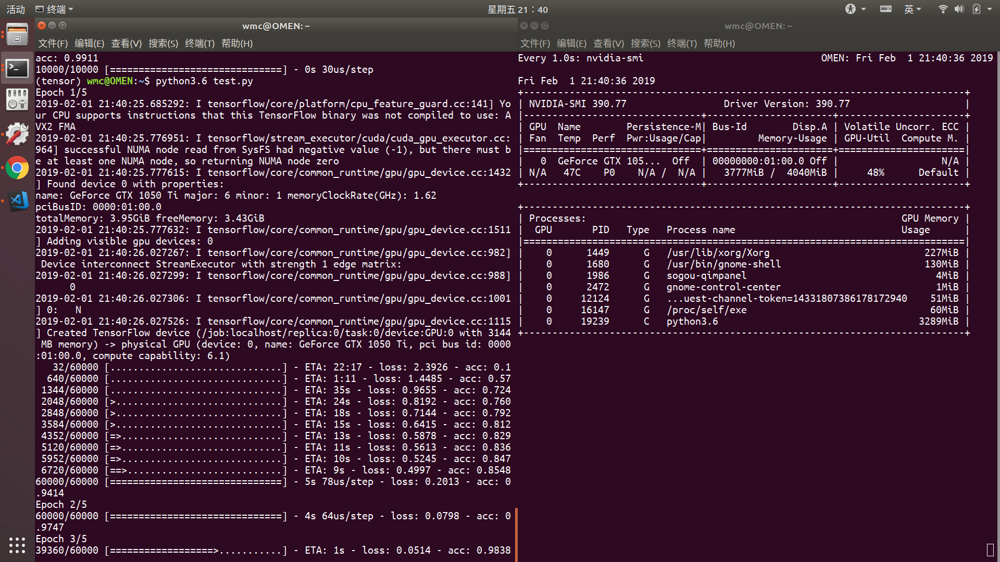

### 显卡驱动
<!-- more -->
终端执行
```bash
sudo apt install nvidia-driver-390
```


### 安装
官网有安装所需软件要求

#### 安装cuda
使用TensorFlow官方教程一把梭

```bash
# Add NVIDIA package repository
sudo apt-key adv --fetch-keys http://developer.download.nvidia.com/compute/cuda/repos/ubuntu1604/x86_64/7fa2af80.pub
wget http://developer.download.nvidia.com/compute/cuda/repos/ubuntu1604/x86_64/cuda-repo-ubuntu1604_9.1.85-1_amd64.deb
sudo apt install ./cuda-repo-ubuntu1604_9.1.85-1_amd64.deb
wget http://developer.download.nvidia.com/compute/machine-learning/repos/ubuntu1604/x86_64/nvidia-machine-learning-repo-ubuntu1604_1.0.0-1_amd64.deb
sudo apt install ./nvidia-machine-learning-repo-ubuntu1604_1.0.0-1_amd64.deb
sudo apt update

# Install CUDA and tools. Include optional NCCL 2.x
sudo apt install cuda9.0 cuda-cublas-9-0 cuda-cufft-9-0 cuda-curand-9-0 \
    cuda-cusolver-9-0 cuda-cusparse-9-0 libcudnn7=7.2.1.38-1+cuda9.0 \
    libnccl2=2.2.13-1+cuda9.0 cuda-command-line-tools-9-0

# Optional: Install the TensorRT runtime (must be after CUDA install)
sudo apt update
sudo apt install libnvinfer4=4.1.2-1+cuda9.0
```
注意不要重复安装nvidia显卡驱动。
然后设置环境变量
```bash
export PATH=/usr/local/cuda-9.0/bin/:$PATH
export LD_LIBRARY_PATH=$LD_LIBRARY_PATH:/usr/local/cuda-9.0/extras/CUPTI/lib64
```
检验下安装
```bash
wmc@OMEN:~$ nvcc -V
nvcc: NVIDIA (R) Cuda compiler driver
Copyright (c) 2005-2017 NVIDIA Corporation
Built on Fri_Sep__1_21:08:03_CDT_2017
Cuda compilation tools, release 9.0, V9.0.176
```
### 安装cuDNN
查看[官方安装说明](https://docs.nvidia.com/deeplearning/sdk/cudnn-install/index.html#axzz4qYJp45J2)
选择Tar包安装
```bash
tar -xzvf cudnn-9.0-linux-x64-v7.tgz
sudo cp cuda/include/cudnn.h /usr/local/cuda/include
sudo cp cuda/lib64/libcudnn* /usr/local/cuda/lib64
sudo chmod a+r /usr/local/cuda/include/cudnn.h /usr/local/cuda/lib64/libcudnn*
```
### Anaconda
Anaconda安装十分简单。
安装完成后，我们使用创建一个新的python虚拟环境，安装tensorflow-gpu.
```bash
conda create -n tensor pip python=3.6
source activate tensor
pip install --upgrade tensorflow-gpu
```
然后使用示例程序来测试一下.
```python
import tensorflow as tf
mnist = tf.keras.datasets.mnist

(x_train, y_train),(x_test, y_test) = mnist.load_data()
x_train, x_test = x_train / 255.0, x_test / 255.0

model = tf.keras.models.Sequential([
  tf.keras.layers.Flatten(),
  tf.keras.layers.Dense(512, activation=tf.nn.relu),
  tf.keras.layers.Dropout(0.2),
  tf.keras.layers.Dense(10, activation=tf.nn.softmax)
])
model.compile(optimizer='adam',
              loss='sparse_categorical_crossentropy',
              metrics=['accuracy'])

model.fit(x_train, y_train, epochs=5)
model.evaluate(x_test, y_test)
```
查看下，运行时gpu显存飙升，占用率升到50%，确实是启用了tensorflow-gpu.


#### jupyter支持conda虚拟环境内核
```bash
conda activate tensorflowenv
pip install ipykernel
python -m ipykernel install --user --name tensorflowenv --display-name "Python (tensorflowenv)"
```
#### 安装插件
```bash
conda install -c conda-forge jupyter_contrib_nbextensions
jupyter contrib nbextension install --user
```
